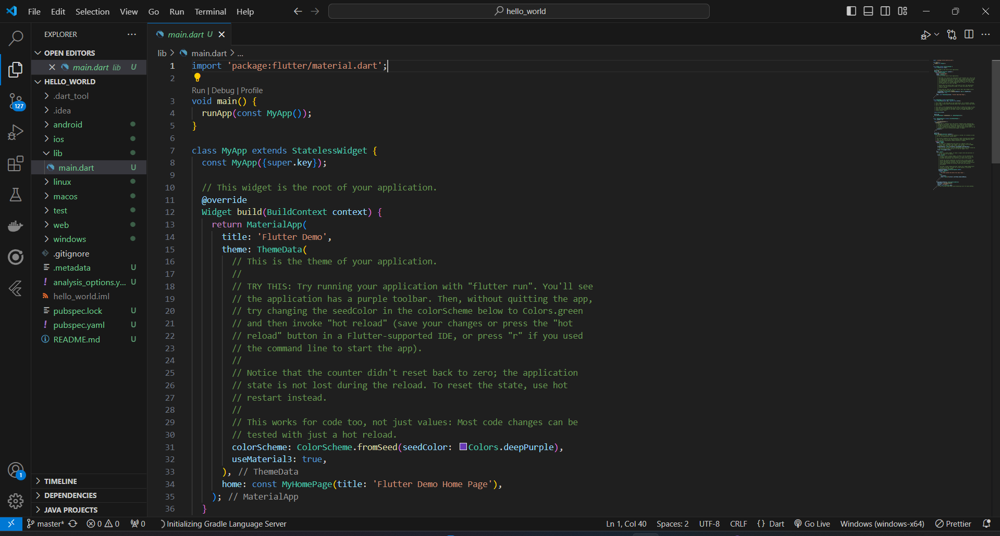
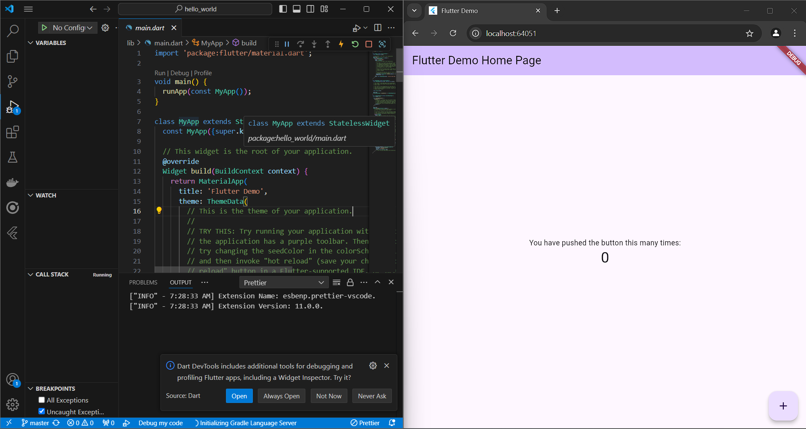
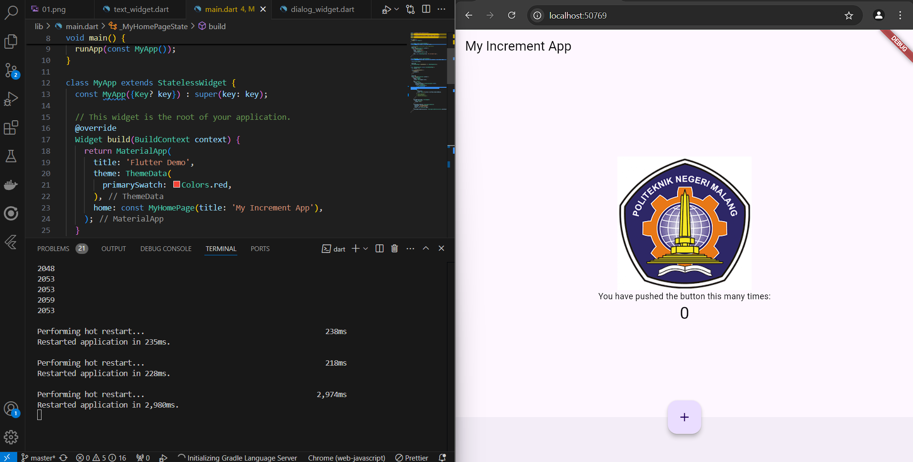

# hello_world

Arya Chandra Kusuma TI 3-C

A new Flutter project.

Hasil Praktikum 1

Pada Praktikum 01, Membuat project flutter baru hasilnya seperti gambar diatas

Hasil Praktikum 2

Pada Praktikum 02, Membuat repo github dan mencoba menjalankan program di browser

Hasil Praktikum 3

Pada Praktikum 03, Menerapkan Widget dasar berupa teks dan image

Hasil Praktikum 4

Pada Praktikum 04, Menerapkan scaffold widget, dialog dan alert widget, input dan selection widget, terakhit Date dan time pickers

## Getting Started

This project is a starting point for a Flutter application.

A few resources to get you started if this is your first Flutter project:

- [Lab: Write your first Flutter app](https://docs.flutter.dev/get-started/codelab)
- [Cookbook: Useful Flutter samples](https://docs.flutter.dev/cookbook)

For help getting started with Flutter development, view the
[online documentation](https://docs.flutter.dev/), which offers tutorials,
samples, guidance on mobile development, and a full API reference.
