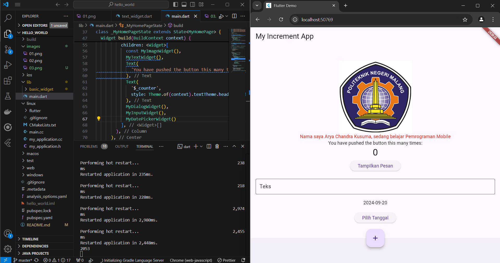

# hello_world

Arya Chandra Kusuma TI 3-C

A new Flutter project.

Hasil Praktikum 1

Pada Praktikum 01, Membuat project flutter baru hasilnya seperti gambar diatas

Hasil Praktikum 2

Pada Praktikum 02, Membuat repo github dan mencoba menjalankan program di browser

Hasil Praktikum 3

Pada Praktikum 03, Menerapkan Widget dasar berupa teks dan image

Hasil Praktikum 4

Pada Praktikum 04, Menerapkan scaffold widget, dialog dan alert widget, input dan selection widget, terakhit Date dan time pickers

Link Pembelajaran :
https://jti-polinema.github.io/flutter-codelab/06-widget-dasar-flutter/#0
